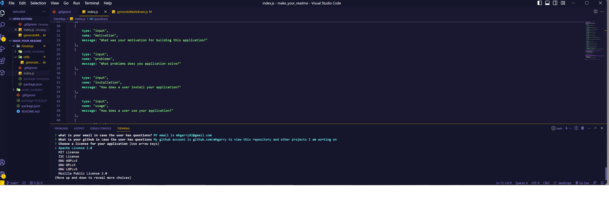

# WriteMyReadMe

## Table of contents

- [WriteMyReadMe](#writemyreadme)
  - [Table of contents](#table-of-contents)
  - [Licensing](#licensing)
  - [Description](#description)
  - [Installation](#installation)
  - [Usage](#usage)
  - [Packages](#packages)
  - [Features](#features)
  - [Resources](#resources)
  - [Tests](#tests)
  - [How to Contribute](#how-to-contribute)
  - [Questions](#questions)
  - [Video Demonstration](#video-demonstration)
  
## Licensing

  Refer to <https://choosealicense.com/> for licensing information
  
  
  

## Description
  
    1. Application description: WriteMyReadMe is a professional, semantic, and well organized README.md generator, built in Node.js, that on initilization prompts the user with various questions to answer in order to pass that data into a README.md file to generate. 
    2. I built this app with myself and other developers in mind to quickly generate clean, efficent, semantic, and professsional README.md files. The importance of README files to other developers and employers cannot be overstated. This is why quickly compiling a professional and semantic markdown file with a simple program is such an exciting prospect
    3. This app makes the task of writing a README.md file for an appliccation extremely efficent and easy. With WriteMyReadMe developers no longer have to worry about the tedious task of writing and formatting Markdown so they have more time to code!
    4. Other than the Video Demonstartion section, some minor edits, and screenshots this README was generated using WriteMyReadMe program completely

## Installation
  
    To install WriteMyReadMe, the user has to clone my Gthub repository https://github.com/mhgarry/WriteMyReadMe  to their local machine and run it in Node.js (more on that in Packages)
     Refer to https://docs.github.com/en/repositories/creating-and-managing-repositories/cloning-a-repository for information on cloning a repository

## Usage

    To use WriteMyReadMe once the repository is cloned to a the user's local machine, the user must navigae to the repostory in the terminal and access the folder develop inside teh parent directory "WriteMyReadMe". Once there the user types "node index.js" into the terminal and presses the "enter" key and the user prompts start showing up. The user must input their data to the prompts so that they can pass that data to the README file being written. Once all prompts are answered the user's unique README.md file is generated

  ![Alt text][def]

## Packages

    Node.js https://nodejs.org/en  and inquirer npm 8.2.5 https://www.npmjs.com/package/inquirer

## Features
  
   WriteMyReadMe is a feature rich program with a lot of functionality and interactivity. One feature this application has is when the user pciks a license to use the application generates a badge of that license to display on the page along with information about the license. And of course WriteMyReadMe turns prompts into a fully functional README files outputting a new file every time the application is initizialized.
  
## Resources
  
   I used JavaScript, Node.js, the inquirer npm package, github, and vsCode to build this application
  
## Tests

   Users can use Jest <https://jestjs.io/docs/getting-started>  to test our application using snapshot testing, manual mocks, and more for example

## How to Contribute
  
  I welcome other developers to contribute to WriteMyReadMe. Those who are interested in contributing should use best practice according to <https://docs.github.com/en/communities/setting-up-your-project-for-healthy-contributions/setting-guidelines-for-repository-contributors>

## Questions
  
  For any further questions I'm avaialble at mhgarry92@gmail.com
  To view and clone this project's repository as well as view other projects I'm working on visit <https://github.com/mhgarry>

## Video Demonstration

Click here for video demonstration! <https://watch.screencastify.com/v/FL3PLskvcU0gdDsx7PNB>
[def]: Assets/images/returned_terminal_objects.png
